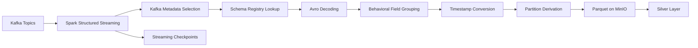
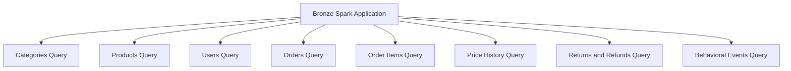
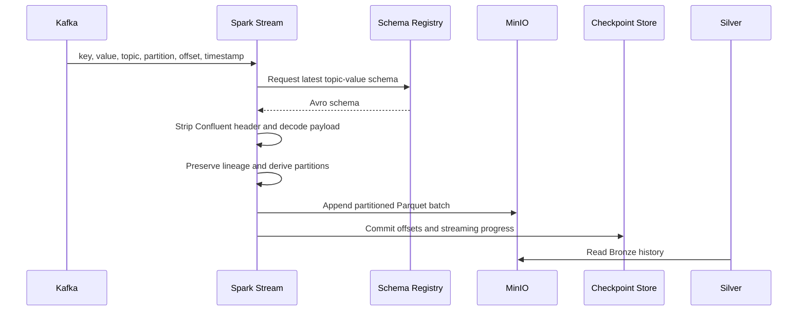
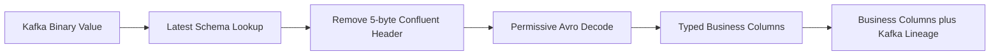

# Bronze Layer Technical Design and Operations Guide

## Document Purpose

This document describes the implemented Bronze ingestion layer. It is intended
for data engineers, reviewers, operators, and maintainers. It records current
code behavior, configuration, storage layout, recovery characteristics, audits,
and known gaps.

## 1. Overview

The Bronze layer continuously consumes Avro messages from Kafka, preserves Kafka
lineage metadata, performs only structural transformations needed for storage,
and appends Parquet files to MinIO through the S3A connector.



Bronze is replay-oriented. Business validation, deduplication, conformance, and
quarantine are Silver responsibilities.

### Main Technologies

- Apache Kafka provides streaming transport and source retention.
- Apache Spark Structured Streaming runs the ingestion queries.
- Avro and Schema Registry provide typed payload decoding.
- MinIO provides object storage for data and checkpoints.
- Parquet is the persisted Bronze data format.
- Hadoop S3A connects Spark to MinIO.
- Docker Compose supplies the local platform runtime.

## 2. Supported Topics

The streaming job attempts to start one query for each configured topic:

| Topic | Partition timestamp | Stored topic path |
| --- | --- | --- |
| `transactional.categories` | `ingested_at` | `transactional/categories` |
| `transactional.products` | `ingested_at` | `transactional/products` |
| `transactional.users` | `signup_date` | `transactional/users_recovery` |
| `transactional.orders` | `timestamp` | `transactional/orders_recovery` |
| `transactional.order_items` | `ingested_at` | `transactional/order_items` |
| `transactional.returns_refunds` | `return_timestamp` | `transactional/returns_refunds` |
| `transactional.product_price_history` | `valid_from` | `transactional/product_price_history_recovery` |
| `behavioral.events` | `timestamp` | `behavioral/events` |

Every topic is partitioned by `year`, `month`, and `day`. If its configured
timestamp field is absent, the transformation logs a warning and falls back to
`ingested_at`. Numeric timestamps support epoch seconds and milliseconds.

The `_recovery` paths are explicit current-code overrides. They allow new streams
and checkpoints to run without reusing older state, but downstream readers and
audits must account for both original and recovery locations.

### Source Domains

The topics belong to two source domains:

- **Transactional:** categories, products, users, orders, order items, product
  price history, and returns/refunds.
- **Behavioral:** application events from `behavioral.events`.

Each topic is consumed by an independent Spark streaming query with its own
Kafka subscription, output path, checkpoint path, partition configuration, and
streaming state.



## 3. Streaming Data Flow

For each topic, `bronze_topic_job.py`:

1. validates the topic against `BUSINESS_TOPICS`;
2. reads Kafka using `KAFKA_BOOTSTRAP_SERVERS`;
3. retains Kafka topic, partition, offset, timestamp, key, and ingestion time;
4. requests the latest subject schema from
   `<SCHEMA_REGISTRY_URL>/subjects/<topic>-value/versions/latest`;
5. strips the five-byte Confluent wire header and decodes Avro permissively;
6. groups behavioral event-specific fields into `event_data`;
7. derives Hive-style date partitions;
8. starts an append-mode Parquet stream with a dedicated checkpoint.

If Schema Registry returns HTTP 404, that topic is skipped. Other startup errors
are logged per topic, allowing unaffected topic streams to start. The process
fails only when no query starts successfully. After startup it waits for any
stream to terminate.

### End-to-End Sequence



### Kafka Read Settings

| Setting | Current behavior |
| --- | --- |
| Starting offsets | `earliest` |
| Maximum offsets per trigger | `10,000` |
| Data loss handling | `failOnDataLoss=false` |
| Subscription | One exact topic per streaming query |

The reader function supports configurable offsets and trigger limits, but the
main job currently uses its defaults rather than the similarly named Compose
variables. This is a **known configuration gap**.

### Metadata Retained

Spark Kafka source exposes transport fields including `key`, `value`, `topic`,
`partition`, `offset`, and `timestamp`. Bronze renames and retains:

- `kafka_key`;
- `kafka_topic`;
- `kafka_partition`;
- `kafka_offset`;
- `kafka_timestamp`;
- `ingested_at`.

The tuple below is the durable source identity used for traceability,
completeness checks, and duplicate detection:

```text
kafka_topic + kafka_partition + kafka_offset
```

For `behavioral.events`, common fields remain top-level and event-specific fields
are grouped into an `event_data` struct.

### Avro Decoding



The schema subject is `<topic>-value`. The decoder handles one magic byte and a
four-byte schema ID before passing the remaining payload to Spark Avro decoder.
It uses the latest registered schema rather than selecting a schema by the
message embedded schema ID. This behavior matters when evaluating schema
compatibility and evolution.

### Transactional and Behavioral Records

Transactional topics keep decoded source-entity fields at the top level. Bronze
does not build entity relationships or analytical models; those operations
belong to Silver.

For `behavioral.events`, these common fields remain top-level:

```text
timestamp
user_id
event_type
device
session_id
```

Available event-specific fields such as product, cart, order, page, search,
payment, rating, and wishlist attributes are grouped into `event_data`. Kafka
lineage and `ingested_at` remain top-level.

## 4. Storage and Checkpoints

The output location is:

```text
<BRONZE_KAFKA_BASE_PATH>/<topic path>/year=<yyyy>/month=<m>/day=<d>/
```

The checkpoint location is:

```text
<BRONZE_CHECKPOINT_BASE>/<topic checkpoint path>/
```

Both output and checkpoint paths use the recovery override for orders, users,
and product price history. Writes use Parquet, append mode, and Spark Structured
Streaming checkpoints.

### Parquet Format

Parquet provides columnar storage, compression, typed schemas, efficient Spark
reads, partition pruning, and broad compatibility with lakehouse tooling.
Append semantics fit continuously arriving Kafka events; updates and business
deduplication are intentionally deferred to Silver.

### Checkpoint Contents

Each topic has an independent checkpoint containing processed Kafka offsets,
streaming progress, commit metadata, and recovery state. The implemented
checkpoint layout is the topic path directly below `BRONZE_CHECKPOINT_BASE`; it
does not currently include separate query-name or version directories.

Do not delete or reuse a checkpoint casually. A checkpoint holds the Kafka
progress and streaming-query state. Pairing an old checkpoint with a new output
path can skip data; pairing a new checkpoint with an existing output path can
replay data and create duplicate Kafka offsets.

## 5. Configuration

### Required Runtime Variables

| Variable | Purpose |
| --- | --- |
| `KAFKA_BOOTSTRAP_SERVERS` | Kafka broker list |
| `SCHEMA_REGISTRY_URL` | Schema Registry base URL |
| `BRONZE_KAFKA_BASE_PATH` | MinIO/S3A Bronze output base |
| `BRONZE_CHECKPOINT_BASE` | Streaming checkpoint base |
| `MINIO_ENDPOINT` | MinIO endpoint |
| `MINIO_ACCESS_KEY` | S3A access key |
| `MINIO_SECRET_KEY` | S3A secret key |

MinIO is configured with the S3A filesystem, path-style access, simple static
credentials, and SSL inferred from whether the endpoint starts with `https://`.
Secrets belong in the ignored `.env` or a secrets manager, never in source code.

### Runtime Components

| Component | Responsibility |
| --- | --- |
| Kafka | Publishes and retains source events |
| Spark master | Coordinates the Bronze Spark application |
| Spark workers | Execute streaming tasks |
| Schema Registry | Stores Avro schemas used by the decoder |
| MinIO | Stores partitioned Parquet data and streaming checkpoints |
| Docker Compose | Configures and runs the platform services |

## 6. Running and Inspecting Bronze

From the project directory:

```bash
./scripts/run_bronze_job.sh
```

The script submits the job to `spark://spark-master:7077` from the running
`spark-master` container and supplies the Kafka, Avro, Hadoop AWS, and AWS SDK
packages.

Inspect samples for all topics or one topic:

```bash
./scripts/inspect_bronze_samples.sh all 5
./scripts/inspect_bronze_samples.sh transactional.orders 10
```

The repository also includes `scripts/smoke_test_kafka_topics.sh`, but it
references `spark_apps/bronze/jobs/test_kafka_consumer.py`, which is not present.
Treat that script as a **known gap** until the missing job is restored or the
script is updated.

## 7. Audit Behavior

`audit_bronze_transactional.py` compares every transactional Kafka topic with its
Bronze Parquet output. It checks:

- required Kafka and partition metadata columns;
- correct `kafka_topic`;
- non-null Kafka metadata;
- duplicate topic/partition/offset combinations;
- non-null date partitions;
- Kafka offsets missing from Bronze;
- Bronze offsets no longer visible within Kafka retention.

Missing current Kafka records, duplicates, bad topic values, or invalid metadata
fail a topic. Bronze-only offsets are warnings because Kafka retention may have
expired them.

### Audit Limitations

- The audit derives normal topic paths and does not apply the sink's `_recovery`
  overrides. Orders, users, and product price history can therefore be audited
  against the wrong location.
- It validates every partition date against `ingested_at`, while several topics
  intentionally partition by a business timestamp. This can report valid
  partitions as failures.
- Behavioral events are excluded from this audit.
- No Airflow DAG currently orchestrates the Bronze stream or audit.

These limitations should be fixed before treating the audit as a deployment
gate.

## 8. Restart, Replay, and Recovery

### Normal Restart

Restart the job with the same output and checkpoint paths. Spark resumes from the
checkpointed Kafka offsets. Confirm only one active writer exists for each
topic/checkpoint pair.

### Replay

For an intentional replay:

1. stop the existing stream;
2. choose a new, explicit output path and checkpoint path;
3. record the replay scope and reason;
4. start from the required Kafka offsets;
5. validate counts and Kafka offset uniqueness;
6. update downstream readers before promotion.

Kafka can replay only records still retained by the brokers. Older recovery
requires another retained source or backup.

### Failure Scenarios

| Symptom | Likely cause | Action |
| --- | --- | --- |
| No streams start | Missing environment, Kafka unavailable, or MinIO configuration failure | Check container environment and Spark logs |
| One topic is skipped | Schema subject returns 404 | Confirm `<topic>-value` exists in Schema Registry |
| Avro request fails | Registry URL, network, authentication, or server error | Test Registry connectivity from `spark-master` |
| Parquet write fails | MinIO credentials, bucket, S3A packages, or permissions | Verify MinIO variables and bucket access |
| Null partition columns | Invalid or unparseable source timestamp | Inspect decoded source fields and fallback behavior |
| Duplicate offsets | New checkpoint used with existing output or multiple writers | Stop duplicate writers and reconcile affected partitions |
| Missing records | Kafka retention, checkpoint/output mismatch, or stopped stream | Compare Kafka and Bronze offsets before replay |

## 9. Monitoring Checklist

Monitor:

- Spark application and streaming-query state;
- per-topic startup errors and Schema Registry 404 warnings;
- input rows and processed rows per second;
- batch duration and scheduling delay;
- Kafka consumer lag;
- checkpoint freshness;
- MinIO object growth and write failures;
- duplicate and missing Kafka offsets;
- null partition values and unexpected partition growth.

The current implementation primarily emits console logs. There are no
Bronze-specific alerts, SLAs, or dashboards in the repository.

## 10. Testing

Unit tests cover:

- topic allow-list validation;
- Kafka reader options and metadata selection;
- Schema Registry decoding and failures;
- MinIO/S3A configuration;
- timestamp conversion and partition fallback;
- behavioral event grouping;
- output and checkpoint path construction;
- stream assembly and missing-schema behavior.

Run the Bronze unit suite inside the Spark container:

```bash
docker compose exec -T spark-master \
  /opt/bitnami/python/bin/python3 -m pytest /opt/project/tests/unit/bronze -q
```

## 11. Known Gaps and Recommended Improvements

1. Make the audit use the same path-resolution and partition metadata functions
   as the sink.
2. Wire Kafka starting-offset and trigger-limit environment settings into the
   main streaming job.
3. Restore or replace the missing Kafka smoke-test job.
4. Add an orchestrated deployment and audit workflow with alerting.
5. Add behavioral completeness and duplicate-offset auditing.
6. Define a documented checkpoint migration and replay runbook.
7. Add retention, lifecycle, encryption, and access-control policies for Bronze
   data and checkpoints.
