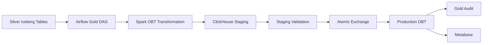
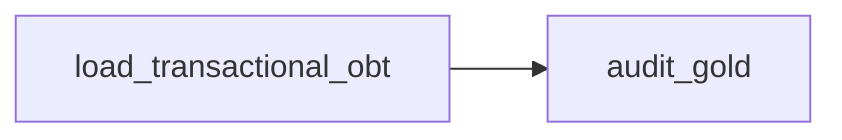
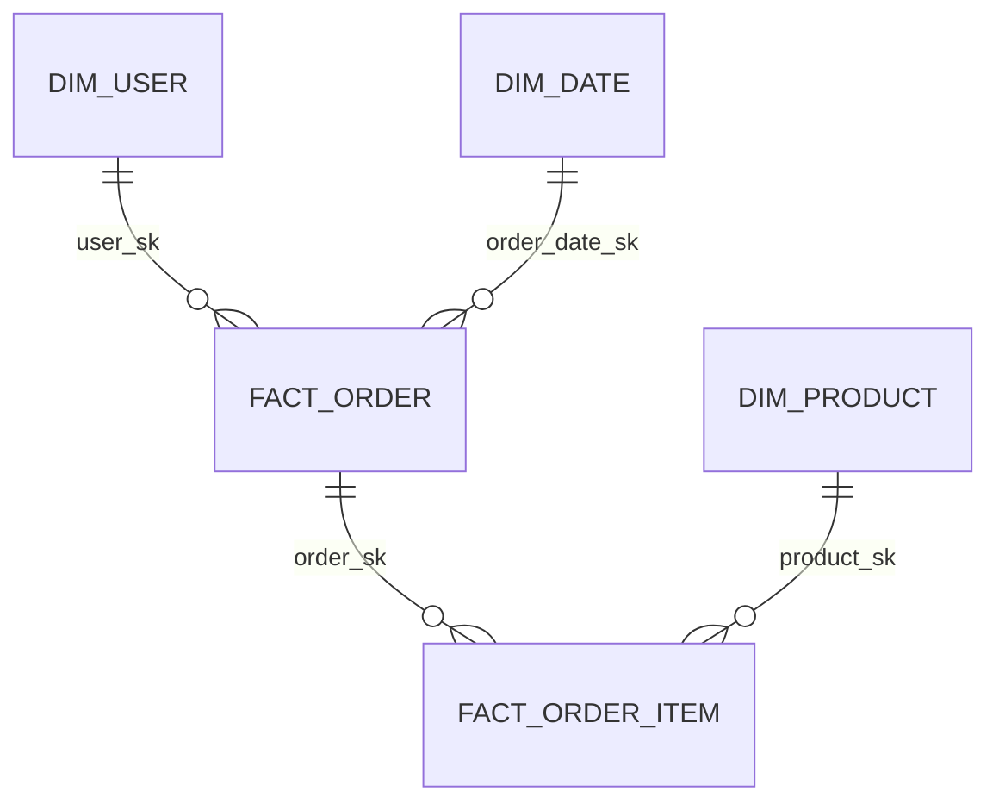
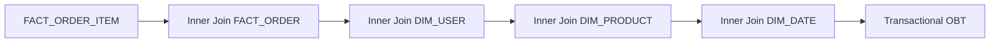
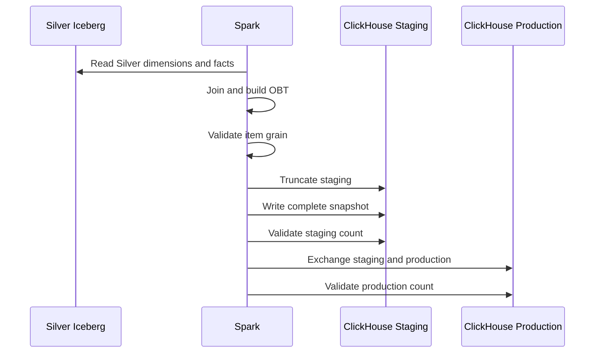

# Gold Layer Technical Design and Operations Guide

## Document Purpose

This document describes the implemented Gold layer. It combines the current
architecture with code-verified behavior for the transactional One Big Table
(OBT), ClickHouse publication workflow, audit, and behavioral Gold jobs. It is
intended for data engineers, analytics engineers, BI developers, operators, and
reviewers.

The transactional OBT is the primary governed Gold model. Behavioral Gold jobs
also exist, but they use separate DAGs and write strategies and do not currently
share the transactional publication and audit framework.

## 1. Purpose and Architecture

Gold converts conformed Silver tables into denormalized, query-oriented models.
The transactional model combines order-item, order, date, user, and Product
fields into a ClickHouse table designed for BI use.



Main technologies:

- Apache Airflow for orchestration;
- Apache Spark for Silver reads and OBT construction;
- Apache Iceberg and PostgreSQL JDBC catalog for Silver access;
- ClickHouse for OLAP storage;
- Metabase for dashboards and reporting.

Gold does not replace Silver as the canonical conformed layer. It publishes
consumer-oriented projections that can be rebuilt from Silver.

## 2. Transactional Gold DAG

| Property | Implemented value |
| --- | --- |
| DAG ID | `gold_transactional_etl` |
| Schedule | None; externally or manually triggered |
| Start date | 2026-07-23 UTC |
| Catchup | Disabled |
| Maximum active runs | One |
| Retries | One after five minutes |
| Spark connection | `spark_standalone` |
| Deploy mode | Client |
| Owner | `group4` |



The DAG comment says Gold is triggered after Silver succeeds, but no code-level
cross-DAG trigger or dataset dependency is implemented. Operators or an external
orchestrator must enforce that ordering.

The load task:

1. verifies the ClickHouse database and tables;
2. truncates only the staging table;
3. reads the five Silver source tables;
4. builds and validates the OBT;
5. writes a complete staging snapshot;
6. validates staging count;
7. atomically exchanges staging and production;
8. validates the published row count.

The audit task independently reconciles production Gold with Silver.

## 3. Source Model

The transactional OBT reads:

```text
dim_date
dim_user
dim_product
fact_order
fact_order_item
```

`fact_return_refund` is not included in the current OBT.





Join keys:

```text
fact_order_item.order_sk      -> fact_order.order_sk
fact_order.user_sk            -> dim_user.user_sk
fact_order_item.product_sk    -> dim_product.product_sk
fact_order_item.order_date_sk -> dim_date.date_sk
```

Product temporal resolution is completed in Silver, so Gold performs a direct
`product_sk` join.

All joins are inner joins. A broken Silver relationship can therefore remove a
source item from the OBT. The pre-write source audit checks uniqueness only; the
downstream `audit_gold` task detects the resulting mismatch against the complete
Silver item count after publication.

## 4. OBT Grain and Measures

The Gold grain is:

> One row per `order_item_sk`.

An order with three items produces three OBT rows:

| `order_id` | `order_item_id` |
| --- | --- |
| O100 | I1001 |
| O100 | I1002 |
| O100 | I1003 |

Therefore:

```text
OBT row count = represented Silver order-item count
```

Only orders with at least one item are represented.

### Preventing Order Double Counting

At item grain, `order_total` repeats on every row. Gold assigns the item with the
smallest `order_item_sk` within each order as its first row.

| `order_id` | `order_item_id` | `order_count_flag` | `order_total` | `order_total_once` |
| --- | --- | ---: | ---: | ---: |
| O1 | I1 | 1 | 300.00 | 300.00 |
| O1 | I2 | 0 | 300.00 | 0.00 |
| O1 | I3 | 0 | 300.00 | 0.00 |

Use:

```sql
SUM(order_count_flag) AS represented_orders,
SUM(order_total_once) AS represented_order_revenue
```

`item_count_in_order` is calculated with a window by `order_sk` and repeated on
every item row for that order.

### Price Semantics

- `product_price` is the reference price from the resolved Product SCD2 version.
- `unit_price` is the transaction price recorded on the order item.

The distinction supports reference-versus-sold-price analysis.

## 5. OBT Columns

| Group | Columns |
| --- | --- |
| Item identity | `order_item_sk`, `order_item_id` |
| Order identity/time | `order_sk`, `order_id`, `order_timestamp`, `order_date_sk` |
| Calendar | `full_date`, `year`, `quarter`, `month`, `month_name`, `week_of_year`, `day`, `day_of_week`, `day_name`, `is_weekend` |
| Order measures | `order_count_flag`, `item_count_in_order`, `order_total`, `order_total_once` |
| Order attributes | `status`, `payment_method` |
| User | `user_sk`, `user_id`, `username`, `email`, `signup_date`, `device`, `loyalty_tier`, `location` |
| Product | `product_sk`, `product_id`, `product_name`, `product_price`, `product_resolution` |
| Item measures | `quantity`, `unit_price`, `item_total_amount` |
| Metadata | `gold_loaded_at` |

## 6. ClickHouse Physical Design

The configured database defaults to `gold` and must use:

```sql
ENGINE = Atomic
```

The loader verifies the engine and fails before publication if it differs.

Two identically defined tables are maintained:

| Table | Purpose |
| --- | --- |
| `<database>.transactional_obt` | Current production snapshot |
| `<database>.transactional_obt_staging` | Candidate or previous snapshot |

Both tables use `MergeTree`:

```sql
PARTITION BY toYYYYMM(full_date)
ORDER BY
(
    full_date,
    product_id,
    user_id,
    order_id,
    order_item_id
)
```

The monthly partition supports date-based pruning. The sort key organizes rows
for common date, Product, user, order, and item access patterns.

### ClickHouse Interfaces

The shared Gold client uses:

- HTTP for administrative SQL such as `CREATE`, `TRUNCATE`, `SELECT engine`, and
  `EXCHANGE TABLES`;
- JDBC for Spark DataFrame writes and reads.

The JDBC writer coalesces the OBT to two partitions before appending to staging.

Required configuration:

| Variable | Purpose |
| --- | --- |
| `CLICKHOUSE_HOST` | ClickHouse service host; defaults to `clickhouse` |
| `CLICKHOUSE_PORT` | HTTP/JDBC port; defaults to `8123` |
| `CLICKHOUSE_DATABASE` | Gold database; defaults to `gold` |
| `CLICKHOUSE_USER` | Required username |
| `CLICKHOUSE_PASSWORD` | Required password |
| Iceberg/MinIO variables | Required by the shared Silver Iceberg Spark builder |

## 7. Full-Snapshot Publication



Publication uses:

```sql
EXCHANGE TABLES
    <database>.transactional_obt
AND
    <database>.transactional_obt_staging
```

Before exchange, production is the previous snapshot and staging is the new
snapshot. After exchange, production is new and staging retains the previous
snapshot. The Atomic database engine makes publication a single metadata
operation.

### Failure Boundaries

- Before exchange, production remains unchanged.
- A staging write or validation failure leaves partial/new data only in staging;
  the next load truncates staging before reuse.
- After exchange, the old production snapshot remains in the staging table and
  can support a deliberate exchange-back rollback.
- A failure after exchange but before final validation means the new snapshot is
  already live and requires immediate audit or rollback evaluation.

Do not truncate staging after a successful exchange until the rollback window
has been considered.

## 8. Validation and Audit

### Load-Time Checks

Before writing:

- Spark OBT row count;
- distinct `order_item_sk` count;
- duplicate `order_item_sk` group count.

The load fails unless every row has a unique item key.

After writing:

- ClickHouse staging count must equal Spark OBT count.

After publication:

- ClickHouse production count must equal Spark OBT count.

### Gold Audit

The audit checks:

```text
Gold rows                    = Silver fact_order_item rows
Gold distinct items          = Silver fact_order_item rows
Duplicate Gold item keys     = 0
Gold distinct orders         = represented Silver orders
SUM(order_count_flag)        = represented Silver orders
SUM(order_total_once)        = represented Silver order revenue
```

Represented orders are derived by inner joining `fact_order` to the distinct
`order_sk` values in `fact_order_item`. Orders without items are counted and
reported but intentionally excluded from the OBT expectations.

The audit prints a ten-row sample and fails its Spark task if any assertion
fails.

### Audit Gaps

- No explicit null check exists for every Gold column.
- No freshness/SLA threshold is enforced.
- No comparison of dimension attributes against Silver is performed.
- No tolerance is applied to revenue reconciliation; equality is exact.
- No audit-history table persists results by run.
- `fact_return_refund` and behavioral Gold tables are outside this audit.

## 9. Behavioral Gold Scope

Behavioral Gold is implemented through separate jobs and DAGs rather than the
transactional OBT pipeline:

| DAG | Schedule | Primary target |
| --- | --- | --- |
| `behavioral_gold_session_etl` | Daily at 00:00 Asia/Tehran | `gold_behavioral_session` |
| `behavioral_gold_daily_etl` | Daily | `gold_behavioral_daily` |
| `behavioral_gold_user_daily_etl` | Daily at 01:15 UTC | `gold_behavioral_user_daily` |
| `behavioral_gold_entity_daily_etl` | Every three hours UTC | `gold_behavioral_entity_daily` |

These jobs aggregate `silver.fact_behavioral_event` into session, daily, user,
or entity-oriented outputs. Some jobs accept bounded dates or timestamps for
backfills.

### Behavioral Operational Gaps

- The behavioral files are currently untracked in this working tree and should
  be treated as work in progress until intentionally committed and reviewed.
- DAGs use inconsistent Iceberg/PostgreSQL package versions and Spark settings.
- The daily DAG omits an explicit Spark connection and package list.
- Write strategies differ: delete-and-insert, append, and direct JDBC writes are
  all present.
- Table/database configuration is not consistently centralized.
- There is no shared staging/exchange publication workflow.
- There is no behavioral Gold audit equivalent to `audit_gold`.
- Schedules and catchup policies are not coordinated with one another or with
  the behavioral Silver DAG.

## 10. Operations

### Prerequisites

Before triggering transactional Gold:

1. confirm the latest Silver DAG completed successfully;
2. confirm `audit_silver` passed;
3. verify the five required Silver tables and latest Iceberg snapshots;
4. verify ClickHouse credentials and connectivity from the Airflow scheduler;
5. confirm no other Gold load is running;
6. record the expected Silver item and represented-order counts.

### Trigger

```bash
airflow dags trigger gold_transactional_etl
```

The DAG has no schedule, so it must be triggered manually or externally.

### Validate

Confirm both tasks pass, then run:

```sql
SELECT
    count() AS rows,
    uniqExact(order_item_sk) AS distinct_items,
    sum(order_count_flag) AS represented_orders,
    sum(order_total_once) AS represented_revenue,
    max(gold_loaded_at) AS latest_load
FROM gold.transactional_obt;
```

Check staging before treating it as disposable:

```sql
SELECT count(), max(gold_loaded_at)
FROM gold.transactional_obt_staging;
```

### Rollback

Immediately after a successful publication, staging holds the previous
production snapshot. If the new snapshot must be reverted and staging has not
been overwritten:

1. stop or pause new Gold loads;
2. validate that staging is the intended previous snapshot;
3. execute the same `EXCHANGE TABLES` statement;
4. rerun `audit_gold`;
5. document the incident and prevent automatic reuse of the rejected snapshot.

Rollback is an operator action; no automated rollback task is implemented.

### Common Failures

| Symptom | Likely cause | Action |
| --- | --- | --- |
| Missing Silver table | Silver DAG incomplete or catalog misconfigured | Verify `audit_silver`, catalog, and table names |
| OBT source duplicate failure | Duplicate `order_item_sk` after joins | Audit Silver item grain and dimension keys |
| OBT source count below Silver items | Inner join lost unresolved relationships | Check User, Product, Date, and Order foreign keys |
| Staging count mismatch | Partial JDBC write or ClickHouse error | Leave production unchanged; inspect staging and driver logs |
| Database engine failure | Existing Gold database is not Atomic | Migrate deliberately; do not bypass the guard |
| Exchange failure | Engine/table/schema incompatibility or permissions | Compare both table definitions and ClickHouse grants |
| Production count mismatch | Post-exchange visibility or publication issue | Audit production immediately and evaluate exchange-back |
| Revenue audit failure | Incorrect helper measure or changed Silver totals | Compare represented Silver orders with Gold first rows |

## 11. Monitoring

Monitor:

- Airflow load/audit status, retries, and duration;
- Silver-to-Gold item-count reconciliation;
- represented-order and revenue reconciliation;
- ClickHouse write errors and exchange failures;
- staging and production row counts;
- `gold_loaded_at` freshness;
- query latency and monthly partition growth;
- staging age and whether it still represents a usable rollback snapshot.

Current logging is console-based. There is no Gold run-control table, persisted
audit history, formal freshness SLA, or automated alert defined in this
repository.

## 12. Testing and Review Checklist

### Automated Coverage

No dedicated transactional Gold unit-test directory is present. The production
load and audit provide runtime checks, but transformation and publication logic
should also receive isolated tests.

Recommended tests:

- join completeness and item grain;
- helper measures for zero-, one-, and multi-item orders;
- unknown User/Product behavior;
- ClickHouse DDL generation;
- staging count failure;
- exchange success/failure;
- audit reconciliation and decimal behavior.

### Release Checklist

- [ ] Latest Silver run and `audit_silver` passed.
- [ ] Required Silver snapshots and schemas are compatible.
- [ ] OBT item grain and helper measures are tested.
- [ ] Production and staging schemas are identical.
- [ ] Gold database engine is Atomic.
- [ ] Staging count equals Spark source before exchange.
- [ ] Production count equals Spark source after exchange.
- [ ] `audit_gold` passed all six reconciliations.
- [ ] Previous snapshot retention/rollback decision is recorded.
- [ ] Metabase queries use `order_count_flag` and `order_total_once` correctly.
- [ ] Behavioral Gold changes are reviewed independently.

## Implementation References

- `airflow/dags/gold_transactional_etl.py`
- `spark_apps/gold/transforms/transactional_obt.py`
- `spark_apps/gold/jobs/load_transactional_obt.py`
- `spark_apps/gold/jobs/audit_gold.py`
- `spark_apps/gold/common/clickhouse.py`
- `spark_apps/gold/config/clickhouse.py`
- `spark_apps/gold/config/tables.py`
- `airflow/dags/behavioral_gold_*_etl.py`
- `spark_apps/gold/jobs/load_gold_behavioral_*.py`
