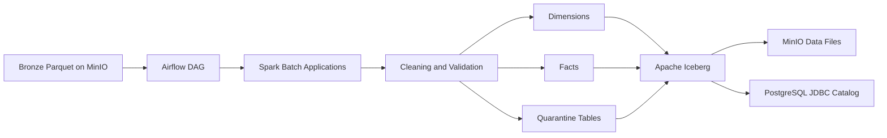
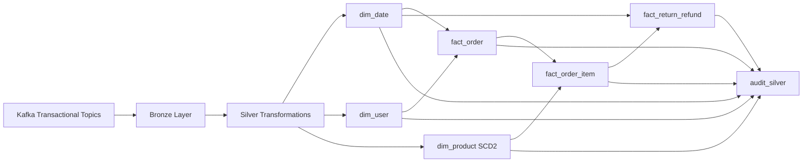
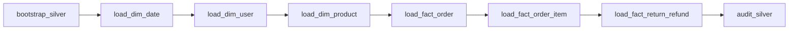
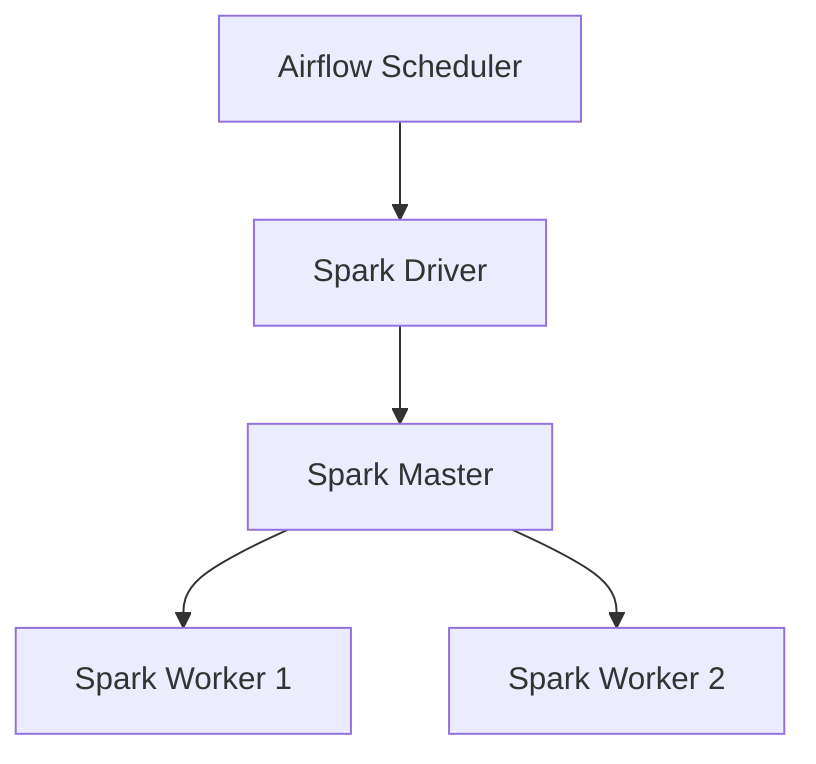
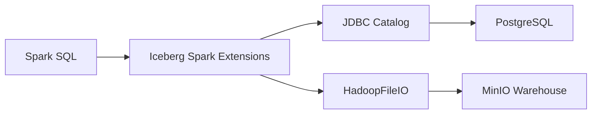
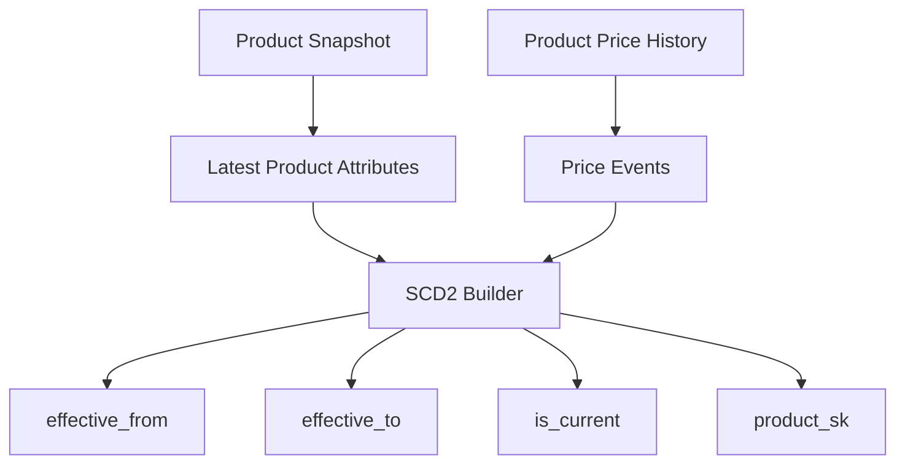
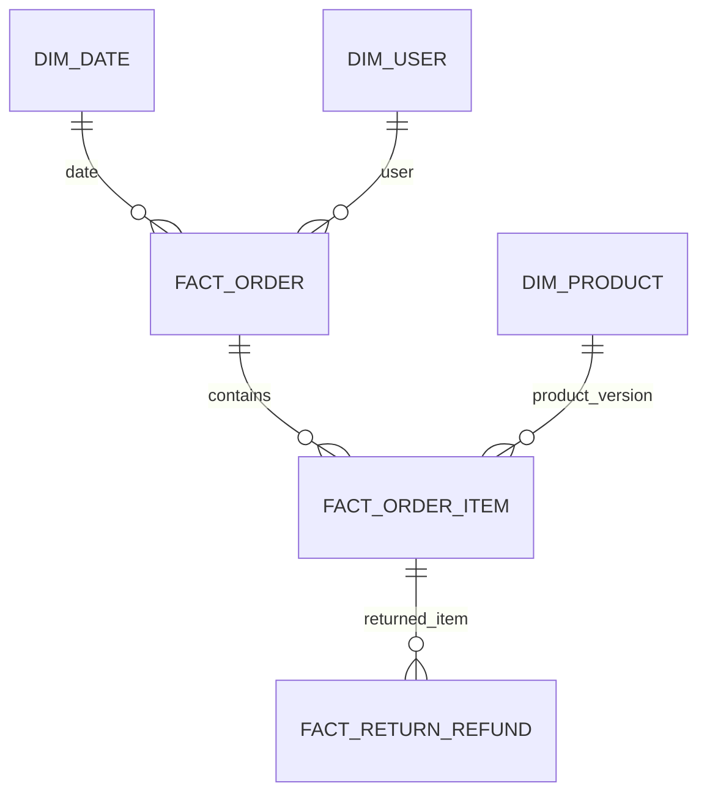
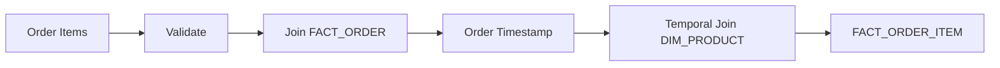

# Silver Layer Technical Design and Operations Guide

## Document Purpose

This document describes the implemented Silver layer of the billing reconciliation
pipeline. It is intended for data engineers, reviewers, operators, and maintainers.
The primary scope is the transactional Bronze-to-Silver path used by the
transactional Gold output. The separate behavioral-event Silver path is included
where it differs operationally.

This guide should be used with
[`bronze_layer.md`](./bronze_layer.md), which defines the upstream topic list,
physical storage layout, Kafka lineage fields, checkpoint behavior, and replay
procedure. Where the two layers meet, the Silver reader implementation is the
authority for which Bronze paths are included in a load.

## Assumptions and Confirmed Scope

- Apache Airflow orchestrates PySpark jobs through `SparkSubmitOperator`.
- Bronze data is Parquet in MinIO/S3-compatible storage. Transactional readers use
  `BRONZE_KAFKA_BASE_PATH`; behavioral data uses `BEHAVIORAL_BRONZE_PATH`.
- Silver transactional data is stored as Apache Iceberg v2 tables in the
  `<catalog>.silver` namespace. Transactional quarantine data is stored in
  `<catalog>.silver_quarantine`.
- The Iceberg catalog name and connection details are environment-configured.
- Transactional Gold consumes the Silver star schema to build a ClickHouse
  order-item-grain OBT for reporting.
- This document records current code behavior. Items marked **Gap** are not
  implemented and should not be assumed to exist.
- `transactional.categories` is configured as a Bronze topic but is not read by a
  current Silver load.
- `fact_return_refund` is loaded and audited in Silver but is not consumed by the
  current transactional Gold OBT.
- A successful Bronze streaming start does not by itself prove that every topic
  is complete. Silver operators must verify required paths and Kafka lineage
  before a production rebuild.

## 1. Silver Layer Overview

### Responsibilities

The Silver layer converts source-shaped Bronze records into typed, canonical,
quality-controlled dimensions and facts. It:

- reads the full available Bronze history;
- trims and normalizes business fields;
- casts dates, timestamps, and monetary values;
- selects the latest source version for Type 1 entities and facts;
- builds a Product SCD Type 2 history;
- creates deterministic surrogate keys;
- resolves relationships between facts and dimensions;
- separates invalid records into quarantine;
- writes curated Iceberg tables;
- runs table-level and cross-table audits.

### High-Level Architecture



Main technologies:

- Apache Airflow for orchestration;
- Apache Spark for batch transformation;
- Apache Iceberg for ACID table and snapshot management;
- PostgreSQL for Iceberg JDBC catalog metadata;
- MinIO for the Iceberg warehouse;
- Parquet for underlying data files.

### Position Between Bronze and Gold

```text
Kafka/source systems
        |
        v
Bronze Parquet (raw/minimally processed, source metadata retained)
        |
        v
Silver Spark cleaning, validation, deduplication, conformance, quarantine
        |
        +--> Silver Iceberg dimensions and facts
        +--> Silver quarantine Iceberg tables
        |
        v
Gold ClickHouse transactional OBT and dashboards
```

Bronze preserves replayable source records. Silver establishes trustworthy grains,
keys, types, relationships, and standardized values.

### Transactional Lineage



The return/refund fact is included because it is part of the implemented Silver
DAG and `audit_silver`, although the current transactional Gold OBT does not
consume it.


## 2. Silver DAG Explanation

### Transactional DAG

| Property | Implemented Value |
| --- | --- |
| DAG name | `silver_transactional_etl` |
| Purpose | Transform transactional Bronze Parquet into curated and quarantined Silver Iceberg tables |
| Schedule | `0 */6 * * *` (every six hours) |
| Start date | 2026-07-17 UTC |
| Catchup | Disabled |
| Concurrency | `max_active_runs=1` |
| Retries | One retry after five minutes |
| Owner | `group4` |
| Spark connection | `spark_standalone` |

The DAG is a fully sequential chain:



| Task | Input | Main Output |
| --- | --- | --- |
| `bootstrap_silver` | Iceberg catalog | Silver namespace and temporary smoke-test table |
| `load_dim_date` | Bronze `transactional.orders` | `silver.dim_date` |
| `load_dim_user` | Bronze `transactional.users` | `silver.dim_user`, quarantine invalid users |
| `load_dim_product` | Bronze `transactional.products`, `transactional.product_price_history` | `silver.dim_product`, quarantine invalid product records |
| `load_fact_order` | Bronze `transactional.orders`, `silver.dim_user` | `silver.fact_order`, quarantine invalid orders |
| `load_fact_order_item` | Bronze `transactional.order_items`, `silver.fact_order`, `silver.dim_product` | `silver.fact_order_item`, quarantine invalid items |
| `load_fact_return_refund` | Bronze `transactional.returns_refunds`, `silver.fact_order_item` | `silver.fact_return_refund`, quarantine invalid returns/refunds |
| `audit_silver` | All transactional Silver tables | Pass/fail audit in task logs |

The bootstrap task creates, inserts into, and merges a
`silver.__iceberg_smoke_test` table. It verifies catalog and Iceberg MERGE support;
it does not create all production tables in advance.

### Spark and Iceberg Runtime

Each Airflow task submits a separate Spark application through
`SparkSubmitOperator`. In client deploy mode, the Spark driver runs with the
Airflow scheduler and executors run on Spark workers.



The applications load the Iceberg Spark runtime, PostgreSQL JDBC driver, S3A
configuration, project Python modules, and shared Spark settings.



| Component | Responsibility |
| --- | --- |
| Spark | Executes transformations and Iceberg table operations |
| Iceberg | Provides snapshots, ACID commits, schema, and table metadata |
| PostgreSQL | Stores JDBC catalog metadata |
| MinIO | Stores Iceberg metadata and Parquet data files |

The main transactional namespaces are `<catalog>.silver` and
`<catalog>.silver_quarantine`.

### Behavioral DAG

| Property | Implemented Value |
| --- | --- |
| DAG name | `behavioral_silver_etl` |
| Purpose | Process behavioral Bronze events by event-time interval |
| Schedule | `0 */3 * * *` (every three hours, UTC) |
| Start date | 2026-07-12 UTC |
| Catchup | Disabled, despite a code comment referring to historical recovery |
| Tasks | One task: `load_fact_behavioral_event` |
| Retries | One retry after five minutes |
| Timeout | 90 minutes |
| Manual interval | `dag_run.conf.start_ts` and `dag_run.conf.end_ts` |

Scheduled runs pass Airflow's `[data_interval_start, data_interval_end)` in UTC.
Manual runs may override both timestamps.

### Failure Handling

- A Spark exception, missing source path/table, failed canonical-source audit,
  failed write, or failed final audit fails the Airflow task.
- Airflow retries the failed task once after five minutes.
- Downstream tasks do not run after an upstream failure.
- Transactional `audit_silver` fails the DAG if uniqueness, null-key, referential,
  or SCD2 checks fail.
- Record-level validation failures do not fail a task when the remaining canonical
  source passes audits; those rows are quarantined and logged as warnings.
- The behavioral task treats missing daily Bronze partitions as informational. It
  succeeds with no work if none of the requested partition paths exist.

### Monitoring

Monitor:

- Airflow DAG/task state, duration, retry count, and Spark-submit logs;
- source, valid, invalid, and target row counts printed by each job;
- Unknown User and Unknown Product mapping counts;
- Product SCD2 version/current-row counts;
- `audit_silver` PASS/FAIL output;
- quarantine volumes and reason distribution;
- Iceberg snapshot counts and unexpected growth;
- the provisioned Grafana dashboard `airflow-silver-real.json`, subject to the
  environment's Airflow/Prometheus metric configuration.


### Safe Reruns

Transactional curated tables can be rerun from the failed task because:

- `dim_date` inserts only missing dates using MERGE;
- `dim_user` performs a Type 1 MERGE keyed by `user_id`;
- `dim_product` is rebuilt with full overwrite;
- all three transactional facts are rebuilt with full overwrite;
- surrogate keys are deterministic (`xxhash64` of business keys, and Product
  business key plus effective timestamp).

Run tasks in dependency order whenever an upstream table may have changed. A full
DAG rerun is the safest choice after Bronze corrections.

Important limitations:

- Transactional quarantine writes append. The deterministic
  `_dq_quarantine_id` is deduplicated only inside the current DataFrame, not
  against the existing table. Repeating a load can therefore append duplicate
  quarantine IDs.
- `silver_created_at` and `silver_updated_at` are regenerated on full-overwrite
  tables, so they describe the latest rebuild rather than the first-ever arrival.
- A failure after a table write but before its final audit may leave that write
  committed. The next curated-table rerun remains safe under the strategies above.
- Behavioral valid and quarantine tables use MERGE by `event_key` and
  `quarantine_key`, respectively, and are idempotent for the same interval.

## 3. Data Flow

### Transactional Flow

1. `bootstrap_silver` verifies the catalog, creates the `silver` namespace, and
   validates Iceberg INSERT and MERGE behavior.
2. `load_dim_date` reads order timestamps, finds the minimum and maximum order
   dates, generates a continuous calendar through the later of the maximum order
   date or 2030-12-31, and inserts missing dates.
3. `load_dim_user` reads users, normalizes text, selects the latest Kafka record
   per `user_id`, validates it, merges valid rows as a Type 1 dimension, ensures
   Unknown User `user_sk=-1`, and appends invalid rows to quarantine.
4. `load_dim_product` reads Product snapshots and price history, validates both
   sources, constructs price-change events and non-overlapping SCD2 intervals,
   adds Unknown Product `product_sk=0`, fully overwrites the dimension, and
   appends invalid rows to quarantine.
5. `load_fact_order` reads orders, normalizes and deduplicates them, validates
   fields, resolves `user_sk`, maps unresolved but structurally valid users to
   `-1`, derives `order_date_sk`, fully overwrites the fact, and quarantines
   source-invalid orders.
6. `load_fact_order_item` reads items, normalizes and deduplicates them, validates
   quantities and amounts, requires an existing parent order, resolves the Product
   version effective at the order timestamp, maps unresolved Products to `0`,
   fully overwrites the fact, and quarantines source-invalid or orphan items.
7. `load_fact_return_refund` reads returns/refunds, normalizes, casts, and
   deduplicates them, requires a matching order item and consistent order,
   validates time ordering, fully overwrites the fact, and quarantines failures.
8. `audit_silver` checks uniqueness, non-null surrogate keys, SCD2 integrity,
   referential integrity, and Iceberg snapshot availability.
9. The separately triggered `gold_transactional_etl` reads `dim_date`,
   `dim_user`, `dim_product`, `fact_order`, and `fact_order_item` to build the
   ClickHouse OBT. There is no code-level trigger from the Silver DAG.

### Bronze Inputs

Silver uses `spark_apps/silver/common/bronze_reader.py` to resolve the Bronze
base path, map logical topics to physical paths, scan Hive-style partitions,
and combine original and recovery datasets. This keeps storage-path logic out of
the individual dimension and fact builders.

```text
<bronze-base>/<domain>/<topic>/year=*/month=*/day=*
```


| Bronze Logical Topic | Physical Read Behavior | Silver Consumer |
| --- | --- | --- |
| `transactional.orders` | Original path plus `transactional/orders_recovery` | Date and Order |
| `transactional.users` | Original path plus `transactional/users_recovery` | User |
| `transactional.products` | Topic path derived by replacing `.` with `/` | Product |
| `transactional.product_price_history` | Original path plus `transactional/product_price_history_recovery` | Product SCD2 |
| `transactional.order_items` | Derived topic path | Order Item |
| `transactional.returns_refunds` | Derived topic path | Return/Refund |
| `transactional.categories` | Configured only | None (**Gap**) |

All transactional readers scan `year=*/month=*/day=*` below the applicable path
and combine original and recovery data with
`unionByName(allowMissingColumns=True)`. This tolerates additive schema
differences, but it does not deduplicate records shared by original and recovery
paths. The entity loaders’ latest-record logic removes repeated identified
business keys; records without usable business keys can still reach quarantine
more than once.

Bronze partition dates are not uniformly ingestion dates. Orders use the source
`timestamp`, users use `signup_date`, price history uses `valid_from`, and
returns/refunds use `return_timestamp`; other transactional topics use
`ingested_at`. Silver reads all transactional partitions, so partition pruning
does not currently limit the full-history loads.

### Bronze Readiness Prerequisites

Before running a transactional Silver rebuild:

1. confirm the normal paths exist for every required topic;
2. confirm recovery paths exist for orders, users, and price history when those
   streams have produced data;
3. compare Kafka topic/partition/offset lineage across normal and recovery paths
   for accidental overlap;
4. verify decoded schemas are compatible with the Silver loaders;
5. confirm all Bronze streaming writers are healthy or intentionally stopped;
6. record the Bronze replay or correction scope before rerunning Silver.

The current transactional Bronze audit is useful diagnostic evidence but is not
a reliable Silver readiness gate: it does not resolve recovery-path overrides
and validates all partition dates against `ingested_at`, even when a topic is
partitioned by a business timestamp. See the Bronze guide’s audit limitations.

### Behavioral Flow

The behavioral task identifies existing daily partitions intersecting the run
interval, reads them, derives event time from application `timestamp` with Kafka
timestamp fallback, validates fields and partition alignment, and splits rows:

- valid interval rows are inserted once into `silver.fact_behavioral_event`;
- invalid relevant rows are merged into
  `silver.quarantine_behavioral_event`;
- a row newly quarantined is removed from the valid table if it had previously
  been accepted.

## 4. Data Validation

### Transactional Validation Matrix

| Validation Rule | Applied To | Failure Condition | Action | Quarantine Reason |
| --- | --- | --- | --- | --- |
| Required user fields | Users | Missing/blank ID, username, email, or location; null signup date or Kafka timestamp | Quarantine | `missing_user_id`, `missing_username`, `missing_email`, `missing_location`, `missing_signup_date`, `missing_kafka_timestamp` |
| Email format | Users | Nonblank email fails basic `local@domain.tld` pattern | Quarantine | `invalid_email` |
| Signup date | Users | Signup date is later than current date | Quarantine | `future_signup_date` |
| Loyalty tier | Users | Normalized tier is not Bronze, Silver, Gold, or Platinum | Quarantine | `invalid_loyalty_tier` |
| Required Product snapshot fields | Products | Missing/blank ID/name; null price or source timestamp | Quarantine | `missing_product_id`, `missing_product_name`, `missing_product_price`, `missing_product_timestamp` |
| Product snapshot price | Products | Price is negative | Quarantine | `negative_product_price` |
| Required price-history fields | Product price history | Missing ID, price, effective timestamp, or Kafka timestamp | Quarantine | `missing_product_id`, `missing_price`, `missing_valid_from`, `missing_kafka_timestamp` |
| Price-history value | Product price history | Price is negative | Quarantine | `negative_price` |
| Required order fields | Orders | Missing ID, user ID, timestamp, total, status, payment method, or Kafka timestamp | Quarantine | Corresponding `missing_*` reason |
| Order date | Orders | Order timestamp is in the future | Quarantine | `future_order_timestamp` |
| Order total | Orders | Total is negative | Quarantine | `negative_order_total` |
| Required item fields | Order items | Missing item/order/Product ID, quantity, unit price, total, or Kafka timestamp | Quarantine | Corresponding `missing_*` reason |
| Item numeric ranges | Order items | Quantity <= 0, unit price < 0, or item total < 0 | Quarantine | `non_positive_quantity`, `negative_unit_price`, `negative_item_total_amount` |
| Item arithmetic | Order items | `abs(item_total - quantity * unit_price) > 0.01` | Quarantine | `item_total_mismatch` |
| Item parent order | Order items | `order_id` does not resolve to `fact_order` | Quarantine | `missing_parent_order` |
| Item Product relationship | Order items | No Product SCD2 interval covers order time | Accept with system member | `product_resolution='unknown_product'`; no quarantine reason |
| Order user relationship | Orders | Structurally valid `user_id` is absent from `dim_user` | Accept with system member | `user_sk=-1`; no quarantine reason |
| Required return/refund fields | Returns/refunds | Missing return ID, order ID, item ID, timestamp, amount, reason, or Kafka timestamp | Quarantine | Corresponding `missing_*` reason |
| Refund amount | Returns/refunds | Refund amount < 0 | Quarantine | `negative_refund_amount` |
| Return parent item | Returns/refunds | Item does not resolve | Quarantine | `missing_parent_order_item` |
| Return/order consistency | Returns/refunds | Source order differs from resolved item's order | Quarantine | `order_item_order_mismatch` |
| Return chronology | Returns/refunds | Return timestamp precedes order timestamp | Quarantine | `return_before_order` |
| Duplicate business keys | Users, Products, Orders, Items, Returns | Multiple identified records for a key | Keep latest according to source-specific ordering; final audits require uniqueness | No quarantine reason for discarded older versions |
| Star-schema integrity | Curated tables | Null/duplicate keys, missing FK target, invalid SCD2 interval/current count | Fail `audit_silver` | Not record-quarantined at this stage |

Multiple applicable transactional failures are stored in one semicolon-separated
`_dq_error_reason`.

### Behavioral Validation

Behavioral rows are quarantined for invalid event time; missing Kafka topic,
partition, or offset; missing user/session/event type/device; unsupported event
type or device; event-date/partition mismatch; negative quantity, cart counts,
cart value, duration, result count, clicked position, or text length; HTTP status
outside 100-599; or rating outside 1-5. All reasons are stored in the
`validation_errors` array.

**Gaps in current validation:**

- Order `status`, `payment_method`, and return reason are normalized but have no
  allowlist or source-to-standard mapping.
- There is no upper bound on order totals, prices, quantities, or refunds.
- Refund amount is not checked against item or order amount.
- Email validation is intentionally simple.
- Duplicate source versions discarded during latest-record selection are not
  quarantined or separately logged.
- Unknown User and Unknown Product rates are observed in logs but have no failure
  threshold.
- Transactional freshness, completeness against Bronze counts, and quarantine-rate
  thresholds are not enforced.

## 5. Data Cleaning

| Cleaning Step | Applied To | Logic | Output | Notes |
| --- | --- | --- | --- | --- |
| Trim business keys | Users, Products, Orders, Items, Returns | `trim`, often after cast to string | Canonical IDs without surrounding spaces | Empty IDs remain invalid |
| Email normalization | Users | Trim then lowercase | Lowercase email | No domain correction |
| Text normalization | Users | Trim username/location; lowercase then title-case loyalty tier | Standard user attributes | Device is trimmed but case is not standardized |
| Null substitution | User device | Null/blank becomes `Unknown` | Nonblank device | Other missing user attributes quarantine |
| Status/payment normalization | Orders | Trim and lowercase | Lowercase values | No allowlist/mapping table |
| Return reason normalization | Returns | Cast, trim, lowercase | Lowercase reason | No allowlist/mapping table |
| Monetary type casting | Product, returns, final facts | Cast to `DECIMAL(10,2)` | Fixed-scale prices/amounts | A failed cast becomes null and is quarantined where validation follows the cast |
| Timestamp casting | Product history, returns, behavioral events | Cast/parse to timestamp | Spark timestamp | Behavioral processing uses UTC |
| Date normalization | Date and facts | Order/return timestamp formatted as `yyyyMMdd` integer key | `order_date_sk`, `return_date_sk` | Date dimension is calendar-based |
| Latest-record deduplication | Users, Product snapshots, Orders, Items, Returns | Partition by business key; order by Kafka timestamp, partition, and offset descending | Latest identified record | Records with missing IDs are retained for quarantine |
| Product SCD2 event deduplication | Product events | Prefer Product snapshot at equal Product/effective time; then latest source timestamp; remove consecutive equal prices | One meaningful price-change event | Builds half-open `[effective_from, effective_to)` intervals |
| Surrogate-key standardization | Dimensions/facts | Deterministic `xxhash64`; Product includes effective timestamp | Stable BIGINT keys | Unknown User = -1; Unknown Product = 0 |
| Record hashing | User, Product | SHA-256 over tracked attributes | `record_hash` | Drives User Type 1 change detection |
| Source-value standardization | Behavioral | Lowercase/trim event type and device | Allowed standard labels | Unsupported values quarantine |
| JSON preservation | Behavioral | Serialize nested event data and original row | JSON lineage columns | Supports debugging and future parsing |
| Unexpected values | All | Quarantine when a rule exists; otherwise retain normalized value | Valid or quarantined row | No speculative correction |

The Product SCD2 construction follows this flow:



Intervals are half-open: `effective_from <= business_timestamp < effective_to`.
The current version has a null `effective_to` and `is_current=true`.

## 6. Quarantine Strategy

### Transactional Design

Invalid transactional records are enriched with:

- `_dq_quarantine_id`: SHA-256 of source topic, Kafka partition, and offset;
- `_dq_entity`;
- `_dq_source_topic`;
- `_dq_error_reason`;
- `_dq_status='open'`;
- `_dq_quarantined_at`;
- original source columns, including Kafka metadata when present.

Tables are created on first invalid write and therefore inherit the invalid
DataFrame schema. They are not declared by a central DDL migration.

| Source / Table | Quarantine Condition | Quarantine Reason | Severity | Stored Metadata | Reprocessing Notes |
| --- | --- | --- | --- | --- | --- |
| Users / `silver_quarantine.invalid_users` | User validation failure | One or more user reasons | Error | Standard DQ fields plus source row and Kafka metadata | Correct/replay Bronze, then rerun from `load_dim_user`; existing open row is not automatically closed |
| Products and price history / `invalid_products` | Snapshot or history validation failure | Product/history reason list | Error | Entity distinguishes `product_snapshot` and `product_price_history`; source topic retained | Correct/replay Bronze, rerun `load_dim_product`; manually reconcile old quarantine rows |
| Orders / `invalid_orders` | Required, date, or total validation failure | Order reason list | Error | Standard DQ and source fields | Correct/replay, rerun order and all downstream facts |
| Order items / `invalid_order_items` | Field/arithmetic failure or missing parent order | Item reason list or `missing_parent_order` | Error | Standard DQ, source fields, and relationship fields where available | Load/correct parent first, then rerun item and return loads |
| Returns/refunds / `invalid_returns_refunds` | Field, parent, consistency, or chronology failure | Return/refund reason list | Error | Standard DQ, source and resolved relationship fields | Correct/replay, then rerun return load |
| Orders with missing dimension user | Valid order references absent user | No quarantine | Warning | `user_sk=-1` in fact | Rerun order after dimension arrives to resolve |
| Items with unresolved temporal Product | No matching Product interval | No quarantine | Warning | `product_sk=0`, `product_resolution='unknown_product'` | Rerun item after Product history is corrected |

Transactional rows are rejected from curated output when quarantined. The code does
not auto-correct invalid business values. Unknown-member mappings are deliberate
warning-level fallbacks, not quarantines.

### Behavioral Design

`silver.quarantine_behavioral_event` stores the validation reason array, raw and
derived timestamps, event-time source, Bronze partition, source file, identifiers,
Kafka coordinates, normalized event/device, nested event JSON, full raw JSON, run
interval, and first/last-seen timestamps. MERGE makes repeated processing
idempotent and updates `last_seen_at`. Newly quarantined keys are removed from the
valid table.

### Inspection

Example Spark SQL:

```sql
SELECT _dq_error_reason, COUNT(*) AS records
FROM <catalog>.silver_quarantine.invalid_order_items
GROUP BY _dq_error_reason
ORDER BY records DESC;

SELECT *
FROM <catalog>.silver_quarantine.invalid_orders
WHERE _dq_status = 'open'
ORDER BY _dq_quarantined_at DESC
LIMIT 100;

SELECT validation_error, COUNT(*) AS records
FROM (
  SELECT explode(validation_errors) AS validation_error
  FROM <catalog>.silver.quarantine_behavioral_event
)
GROUP BY validation_error
ORDER BY records DESC;
```

### Reprocessing

The implemented transactional reprocessing path is to fix or replay the record in
Bronze and rerun the affected task plus its downstream tasks. There is no job that
reads transactional quarantine directly.

**Gaps:**

- No transactional quarantine MERGE/upsert against existing IDs.
- No resolution fields such as `resolved_at`, resolution note, or retry count.
- No automated close/removal when a corrected Bronze record later succeeds.
- No quarantine retention policy, owner workflow, or automated reprocessing DAG.
- No severity column; severity in this document is an operational classification.

## 7. Silver Tables

The placeholder `<catalog>` is the configured Iceberg catalog name.

The transactional tables form this star-schema relationship model:



Order-item Product resolution uses the parent order time for a temporal SCD2
join:



| Silver Table | Purpose | Source Tables | Key Columns | Main Transformations | Validation Rules | Quarantine Logic | Downstream Usage |
| --- | --- | --- | --- | --- | --- | --- | --- |
| `<catalog>.silver.dim_date` | Calendar dimension | Bronze orders | PK `date_sk`; business key `full_date` | Continuous dates from first order through max(last order, 2030-12-31); derives calendar attributes | Load fails if Bronze range cannot be determined; audit checks null/duplicate key | None | Transactional Gold date attributes |
| `<catalog>.silver.dim_user` | Current conformed user attributes (Type 1) | Bronze users | PK `user_sk`; BK `user_id` | Normalize, latest record, deterministic key/hash, Type 1 MERGE, Unknown User | Required fields, email, date, loyalty tier, Kafka time | Invalid rows to `invalid_users` | Gold user attributes; Order FK |
| `<catalog>.silver.dim_product` | Product price/name history (SCD2) | Bronze Products and price history | PK `product_sk`; BK/version `product_id`,`effective_from` | Price events, SCD2 intervals, deterministic key/hash, Unknown Product, full overwrite | Required ID/name/price/time, nonnegative price; SCD2 audit | Invalid snapshot/history rows to `invalid_products` | Gold Product attributes; Item temporal FK |
| `<catalog>.silver.fact_order` | One row per order | Bronze orders; `dim_user` | PK `order_sk`; BK `order_id` | Normalize, latest version, derive date key, resolve/unknown user, full overwrite | Required values, nonnegative total, nonfuture timestamp, uniqueness | Invalid source rows to `invalid_orders`; missing dimension user accepted as unknown | Gold order attributes/measures; parent for Items |
| `<catalog>.silver.fact_order_item` | One row per order item | Bronze items; `fact_order`; `dim_product` | PK `order_item_sk`; BK `order_item_id` | Normalize, latest version, amount check, parent join, temporal Product lookup, full overwrite | Required values, numeric ranges, arithmetic, parent order, uniqueness/FKs | Invalid/orphan rows to `invalid_order_items`; unresolved Product accepted as unknown | Grain of transactional Gold OBT; parent for Returns |
| `<catalog>.silver.fact_return_refund` | One row per return/refund | Bronze returns/refunds; `fact_order_item` | PK `return_refund_sk`; BK `return_refund_id` | Normalize/cast, latest version, resolve item/order/date, full overwrite | Required values, nonnegative refund, parent/consistency/chronology | Invalid rows to `invalid_returns_refunds` | Not used by current Gold OBT (**Gap**) |
| `<catalog>.silver.fact_behavioral_event` | One row per Kafka behavioral event | Behavioral Bronze daily partitions | PK/BK `event_key` | Event-time derivation, normalization, nested-field projection, MERGE insert | Required lineage/identity, allowed labels, numeric ranges, partition alignment | Invalid events go to behavioral quarantine | No Gold consumer found in current repository |
| `<catalog>.silver.quarantine_behavioral_event` | Behavioral invalid-record store | Behavioral Bronze | `quarantine_key` | Raw JSON capture and MERGE with last-seen update | Stores all behavioral validation failures | It is the quarantine table | Engineering inspection/reprocessing |

### Main Columns by Transactional Table

- `dim_date`: `date_sk`, `full_date`, year/quarter/month/week/day attributes,
  `is_weekend`.
- `dim_user`: `user_sk`, `user_id`, username, email, signup date, device,
  loyalty tier, location, hash, source and Silver timestamps.
- `dim_product`: `product_sk`, `product_id`, name, price, effective interval,
  current flag, hash, source kind, source and Silver timestamps.
- `fact_order`: order keys, user/date keys, order timestamp/total, status,
  payment method, source and Silver timestamps.
- `fact_order_item`: item/order/Product/date keys, identifiers, timestamp,
  quantity, unit price, item total, Product resolution, lineage timestamps.
- `fact_return_refund`: return, order, item, and date keys; identifiers; return
  timestamp; refund amount/reason; lineage timestamps.

## 8. Error Handling and Logging

### Errors That Stop the Pipeline

- Missing required environment configuration or unreadable Bronze paths.
- Missing required Iceberg tables or catalog/connectivity failures.
- Empty/unusable order date range.
- Spark schema, execution, or write errors.
- Canonical source duplicates or null resolved keys detected before write.
- Product SCD2 current-row/key audit failures.
- Final target uniqueness, null-key, SCD2, or FK audit failures.
- Behavioral interval arguments where start is not before end.

### Errors That Quarantine Records

Source-row validation failures and transactional relationship failures described in
the validation matrix quarantine only the affected records. The task continues if
the valid canonical source passes its audits. Missing user/Product dimensions use
explicit unknown members rather than quarantine.

### Logged Information

Jobs use standard output captured by Airflow/Spark logs. Depending on the job they
print:

- Bronze, valid, invalid, source, distinct, and target counts;
- duplicate and null-key counts;
- unknown-member and Product-resolution counts;
- SCD2 versions/current-row checks;
- quarantine warning counts;
- table samples in some dimension jobs;
- cross-table audit PASS/FAIL results;
- Iceberg snapshot counts;
- behavioral missing paths, interval, merge counts, and reason summary.

**Gap:** Logging is print-based rather than structured JSON and does not include a
shared run ID in transactional Silver/quarantine tables. There is no separate
pipeline audit table holding metrics by run.

### Debugging a Failed Run

1. Identify the first failed task; downstream failures are usually consequences.
2. Read the Airflow task log and locate the first Spark exception or explicit
   `[FAIL]`/`RuntimeError`.
3. Verify the Spark connection, driver-to-worker networking, Iceberg catalog, and
   MinIO credentials/path environment variables.
4. Confirm all expected Bronze normal/recovery paths and schemas exist.
5. Compare Kafka coordinates across normal and recovery paths before assuming a
   high source count represents new records.
6. Compare the logged source/valid/invalid/distinct counts.
7. Query the relevant quarantine table and group by reason.
8. For FK failures, inspect the parent dimension/fact first.
9. For Product failures, inspect duplicate keys, current-row counts, and interval
   boundaries.
10. Check the latest Iceberg snapshots to determine whether a write committed.
11. Correct/replay Bronze or configuration, then clear/rerun the failed task and
    all downstream tasks.

## 9. Operational Notes

### Run the DAG

In the Airflow UI, enable and trigger `silver_transactional_etl`, or use:

```bash
airflow dags trigger silver_transactional_etl
```

For a bounded behavioral replay:

```bash
airflow dags trigger behavioral_silver_etl \
  --conf '{"start_ts":"2026-07-12 00:00:00","end_ts":"2026-07-13 00:00:00"}'
```

Use UTC and a half-open interval: start inclusive, end exclusive.

### Rerun a Failed Task

- In Airflow, clear the failed task and include downstream tasks when its output
  feeds them.
- For a failure before any write, rerunning only the failed task is sufficient if
  upstream data is unchanged.
- After Bronze correction, rerun from the earliest affected entity:
  - User correction: User -> Order -> Item -> Return -> Audit.
  - Product correction: Product -> Item -> Return -> Audit.
  - Order correction: Date if range changed, then Order -> Item -> Return -> Audit.
  - Item correction: Item -> Return -> Audit.
  - Return correction: Return -> Audit.
- Review/deduplicate transactional quarantine separately after reruns.

### Validate Output

Confirm the final `audit_silver` task passed, then check:

```sql
SELECT COUNT(*), COUNT(DISTINCT order_id)
FROM <catalog>.silver.fact_order;

SELECT COUNT(*), COUNT(DISTINCT order_item_id)
FROM <catalog>.silver.fact_order_item;

SELECT product_resolution, COUNT(*)
FROM <catalog>.silver.fact_order_item
GROUP BY product_resolution;

SELECT COUNT(*)
FROM <catalog>.silver.fact_return_refund
WHERE order_sk IS NULL OR order_item_sk IS NULL;
```

Also compare volumes with recent successful runs and examine quarantine changes.

### Common Failure Scenarios

| Symptom | Likely Cause | Action |
| --- | --- | --- |
| Bronze path read fails | Missing env var, partition, permissions, or changed layout | Verify `BRONZE_KAFKA_BASE_PATH`, object storage, and topic/recovery paths |
| Unexpected source-count increase | Same Kafka offsets exist in original and recovery paths | Compare `kafka_topic`, `kafka_partition`, and `kafka_offset`; reconcile overlap before rerun |
| Valid Bronze partitions fail upstream audit | Bronze audit compares a business-time partition with `ingested_at` | Validate using the topic partition metadata; do not use that audit result alone as a Silver gate |
| Spark submit cannot connect | Bad `spark_standalone` connection or driver/worker network | Check Airflow connection and `airflow-scheduler` driver hostname |
| Package resolution fails | Maven/network/cache issue | Inspect Ivy logs and configured package versions |
| Date task cannot determine range | Orders are empty or all timestamps are null | Inspect Bronze orders and parsing |
| Product source audit fails | Duplicate surrogate key or invalid SCD2 current count | Inspect Product events at equal effective timestamps and hashes |
| High Unknown User count | User arrived late or was quarantined | Inspect `invalid_users`; rerun from User |
| High Unknown Product count | Missing or late Product history, or order predates first version | Inspect Product history/effective intervals |
| Item rows quarantined as missing parent | Order was invalid, absent, or task order was bypassed | Repair/rerun Order before Item |
| Return rows quarantined | Missing item, mismatched order, or invalid chronology | Inspect resolved parent and timestamps |
| Audit FK failure | Partial/manual out-of-order load or inconsistent rebuild | Rerun from the earliest affected upstream task |
| Quarantine duplicates | Transactional task rerun appended same invalid source rows | Deduplicate by `_dq_quarantine_id`; address append-only gap |

### Troubleshooting Checklist

- [ ] Confirm the DAG run interval and task order.
- [ ] Confirm Airflow's Spark connection and required environment variables.
- [ ] Confirm Bronze source and recovery paths exist and have compatible schemas.
- [ ] Confirm original and recovery paths do not contain overlapping Kafka
  coordinates.
- [ ] Account for each topic’s configured partition timestamp when investigating
  missing or unexpected partitions.
- [ ] Find the first error, not only the final Airflow exception.
- [ ] Review source, valid, invalid, distinct, and unknown-member counts.
- [ ] Group quarantine rows by reason and source topic.
- [ ] Check dimension keys before investigating fact FKs.
- [ ] Check Product SCD2 current flags and interval overlap.
- [ ] Check whether an Iceberg snapshot committed before failure.
- [ ] Rerun the affected task and downstream chain.
- [ ] Run/confirm `audit_silver`.
- [ ] Validate the Gold load separately; it is not triggered by the current Silver
  DAG code.

## 10. Final Review Checklist

### DAG Structure

- [ ] Transactional DAG contains all eight tasks in dependency order.
- [ ] Schedules, start dates, retry settings, and `max_active_runs=1` are correct.
- [ ] Spark connection, packages, driver networking, and environment are valid.
- [ ] Behavioral interval handling is tested for scheduled and manual runs.

### Inputs and Outputs

- [ ] Every required Bronze topic/path exists and schema is compatible.
- [ ] Original and recovery paths do not introduce unintended duplicates.
- [ ] All six transactional curated tables exist in the Silver namespace.
- [ ] All expected quarantine tables exist after invalid data is encountered.
- [ ] Unused `categories` input and unused Silver return/behavioral outputs are
  accepted or tracked as gaps.

### Validation and Cleaning

- [ ] Required-field, date, range, arithmetic, and relationship rules are tested.
- [ ] Text, date, timestamp, and decimal normalization is documented and verified.
- [ ] Latest-record selection is deterministic.
- [ ] Product SCD2 has one current row per Product and no interval overlap.
- [ ] Unknown User and Product behavior is accepted and monitored.
- [ ] Missing source allowlists/range limits are accepted or added through a
  separately reviewed logic change.

### Quarantine

- [ ] Each invalid class reaches the correct quarantine table with source metadata.
- [ ] Engineers can group and trace reasons back to Kafka coordinates.
- [ ] Transactional duplicate quarantine IDs are detected after reruns.
- [ ] Ownership, retention, resolution, and reprocessing gaps have tracked work.

### Logging and Operations

- [ ] Task logs expose input, valid, invalid, output, and audit counts.
- [ ] `audit_silver` passes uniqueness, null-key, SCD2, and FK checks.
- [ ] Monitoring covers failures, duration, freshness, unknown-member rates, and
  quarantine growth.
- [ ] Operators know which task and downstream chain to clear.
- [ ] Iceberg snapshots can be inspected during incident response.

### Documentation and Reprocessing Readiness

- [ ] Table grains, keys, transformations, and Gold consumers match the code.
- [ ] Environment variables and connection prerequisites are documented.
- [ ] The correction/replay procedure in `docs/bronze_layer.md` is available and
  its output/checkpoint pairing has been reviewed.
- [ ] Curated-table idempotency has been tested.
- [ ] Transactional quarantine deduplication is handled operationally until the
  append-only design is changed.
- [ ] Gold is run only after successful Silver completion and audit.

## Implementation References

- `docs/bronze_layer.md`
- `airflow/dags/silver_transactional_etl.py`
- `airflow/dags/behavioral_silver_etl.py`
- `spark_apps/silver/common/bronze_reader.py`
- `spark_apps/silver/config/tables.py`
- `spark_apps/silver/dimensions/`
- `spark_apps/silver/facts/`
- `spark_apps/silver/jobs/`
- `spark_apps/silver/quality/`
- `spark_apps/gold/transforms/transactional_obt.py`
